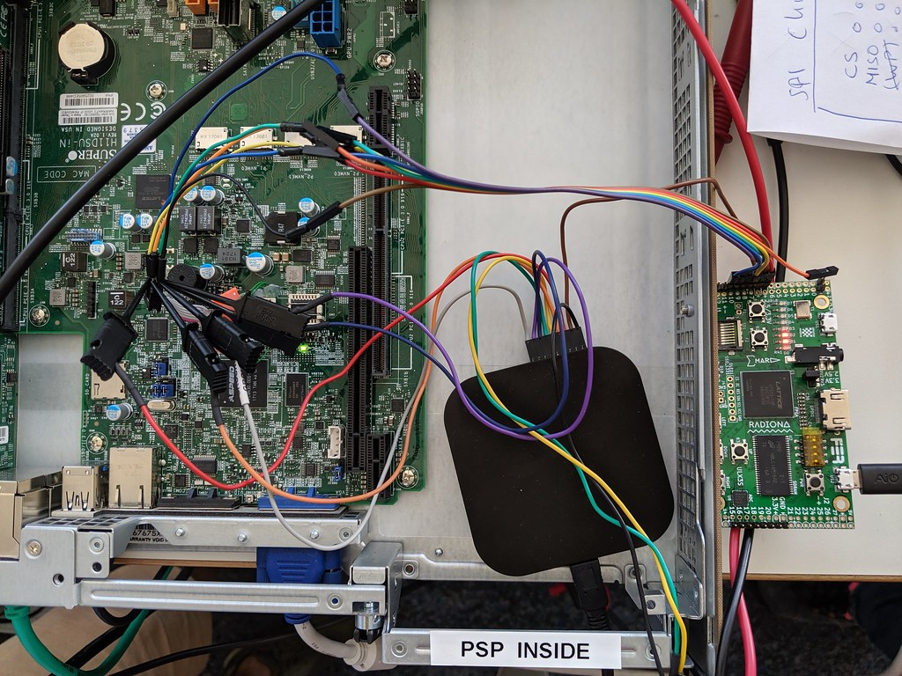
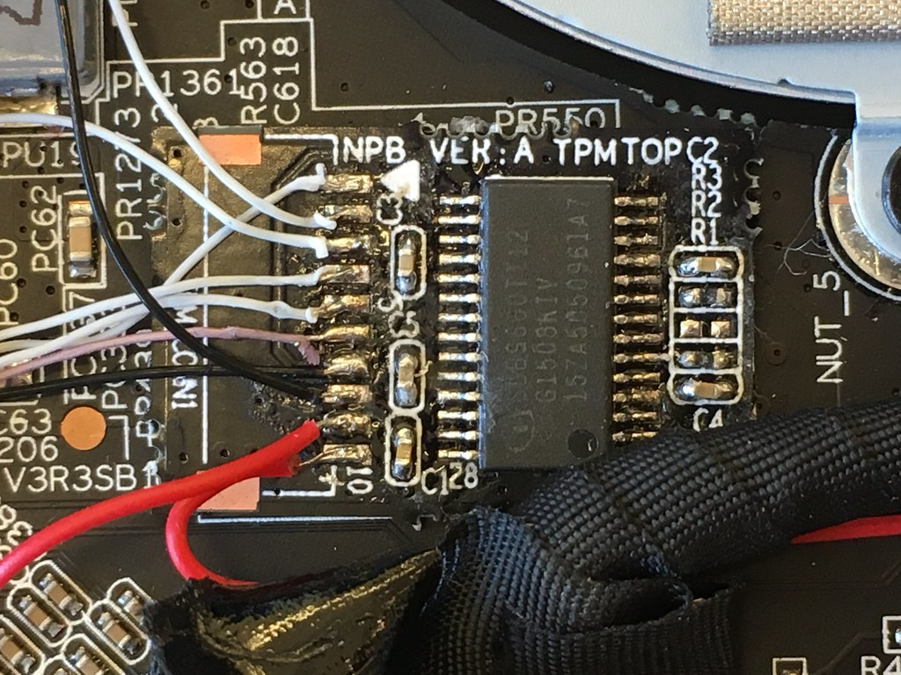
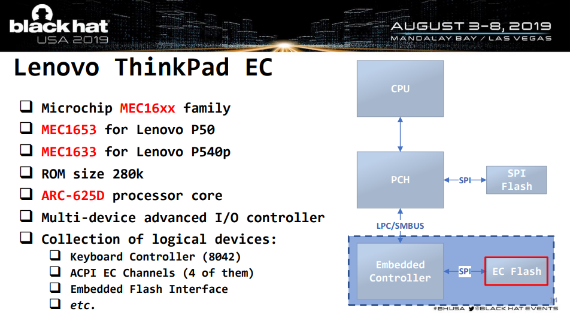

# Frequently Asked Questions

## What is the threat model?

`safeboot` intends to protect the integrity of the boot process and
runtime integrity of the system against adversaries with external physical
access to the device, as well as limited internal physical access.
The assumption is that the attacker can get code execution on the device
as the user and as root, but does not have access to the signing keys
or the disk encryption key. The goal is to prevent the attacker from
exfiltrating data from the device or making persistent changes to the
system configuration.

More details are in [the threat model page](threats.md).

## How is this better than normal UEFI Secure Boot?

`safeboot` is not a replacement for UEFI SecureBoot - the two work together to
improve the security of the system. SecureBoot ensures that the boot firmware is
measured into the TPM and validates the signatures on the Linux kernel and initrd,
and `safeboot` adds additional integrity protections beyond that.

The default UEFI Secure Boot configuration is sufficient for
Microsoft's needs since they are the only signing authority for
their runtime, while Linux computer owners frequently want to
compile their own kernel or runtime.  The compromise solution
developed by Linux distributions has Microsoft sign a
["shim" bootloader](https://mjg59.dreamwidth.org/19448.html)
that has its own key management.  Since most distributions have their
keys enrolled in the shim, systems that have Secure Boot enabled
will boot the distribution's ISOs, which might not be desirable since
it potentially gives an adversary runtime access to unencrypted
parts of the system.

A larger problem is that by default only the Linux kernel is signed,
not the command line parameters or initrd.  While the `grub` bootloader
can enable a password to protect against casual changes to the kernel
parameters, the `grub.cfg` configuration is not signed.   This means
that potentially a local attacker can modify it on disk to launch the
kernel with `init=/bin/sh` to drop into a shell, or an attacker with
root access can add trojan'ed binaries to the initrd to gain persistence.
By replacing the Platform Key and removing `grub`, only Linux kernel and
initrd images signed by the computer owner will boot.

Far more details on how `safeboot` extends UEFI SecureBoot are on
[the threat model page](threats.md).

## How does `safeboot` compare to coreboot?

[coreboot](https://coreboot.org) is entirely free software and can
provide far better control of the boot process, although it is not
supported on as many modern platforms as UEFI SecureBoot and requires
reprogramming the SPI flash on the device.  If you have a machine that
supports both coreboot and Bootguard, then you're probably better off
running it instead.  However, be prepared to spend quite a bit of quality
time with your SPI flash programmer to get it working...

Once coreboot or UEFI hand off to the Linux kernel, the TPM unsealing of
the disk encryption key, the dmverity protections on the root filesystem
and the lockdown patches work the same.

## Does `safeboot` work with AMD cpus?

It has only been tested on the Intel systems with Bootguard.
The UEFI platform keys and the rest of the lock down *should*
work with AMD, although AMD's hardware secured boot process hasn't
been reviewed as extensively as Intel's ME and Bootguard.

For an indepth analysis of the AMD Platform Support Processor (PSP)
and SEV, [Buhren, Eichner and Werling's 35c3 presentation](https://media.ccc.de/v/36c3-10942-uncover_understand_own_-_regaining_control_over_your_amd_cpu)
is the most detailed look so far.

## Why does the TPM unsealing fail often?

It's super fragile right now.  Need to reconsider which PCRs are included
and what they mean.  Suggestions welcome!

## How do I write to the root filesystem?
With SIP enabled it is not possible to modify the root filesystem.
You must reboot into recovery mode with `safeboot recovery-reboot`
and decrypt the disk with the recovery password.  Once decrypted,
you can run `safeboot remount` to unlock the raw device and remount
it `rw`.  After making modifications, it is necessary to sign
the new root hashes with `safeboot linux-sign`.

## How do I switch to a new signing key?
There is probably a way to sign a new PK with the old PK, but I haven't
figured it out...  Instead here are the steps:

* Put the UEFI SecureBoot firmware back in `Setup Mode`
* Boot into the recovery kernel
* `safeboot remount` to get write-access to the disk
* `safeboot key-init` or `safeboot yubikey-init` to build a new key.
Answer "`y`" to overwrite the existing one in `/etc/safeboot/cert.pem`.
* `safeboot uefi-sign-keys` to upload it into the firmware
* `safeboot recover-sign`
* `safeboot linux-sign`, which should re-generate the dmverity hashes
* Reboot into the normal kernel
* `safeboot luks-seal` to measure the new PCRs and normal kernel into the TPM

## What happens if I lose the signing key?
The best solution is to authenticate with the supervisor password
to the UEFI Setup, re-enter SecureBoot setup mode and clear the key
database, then boot into recovery mode and follow the instructions
for switching to a new signing key.  If you don't have the
UEFI Supervisor password, well, then you're in trouble.

## Is it possible to reset the UEFI or BIOS password?

On modern Thinkpads the UEFI password is in the EC, not in the
SPI flash.  Lenovo does a mainboard swap to reset it; you could find
a [EC bypass](https://medium.com/@matrosov/breaking-through-another-side-bypassing-firmware-security-boundaries-85807d3fe604)(Matrosov 2019)
or perhaps a [Bootguard bypass](https://pbx.sh/efitoctou/)(Bosch & Hudson, 2019)
to get into Setup in that case.

[Matrosov's 2019 BlackHat Talk](https://www.blackhat.com/us-19/briefings/schedule/index.html#breaking-through-another-side-bypassing-firmware-security-boundaries-from-embedded-controller-15902)
is a deep dive into the Lenovo EC and why it is not as much of a protection boundary
as some vendors think it is.

## Does it work on the Thinkpad 701c?

Unfortunately the wonderful [butterfly keyboard Thinkpad](https://trmm.net/Butterfly)
predates UEFI by a few years, so it does not have a very secure
boot process.  The X1 Carbon is a much nicer replacement in nearly
every way, other than missing the amazing sliding keyboard mechanism.

## ???

Please [file an issue!](https://github.com/osresearch/safeboot/issues)
Or submit a pull-request!
